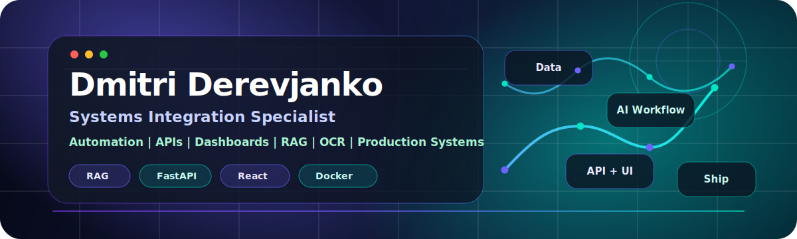

# Hi, I'm Dmitri Derevjanko

### AI Integration Specialist | Automation Builder | Full-Stack AI Developer

I build practical AI systems that move from idea to production: RAG assistants, OCR pipelines, AI agents, dashboards, scraping automations, and backend services that real teams can use.

My focus is end-to-end delivery: data ingestion, embeddings, LLM workflows, APIs, product UI, deployment, monitoring, and the business logic around it.

 

 
 

---

## What I Build

| AI Products | Production Systems | Business Automation |
| --- | --- | --- |
| Source-grounded RAG assistants | FastAPI services and clean API contracts | CRM and workflow automation |
| AI agents for routing, research, and reporting | React/Next.js interfaces for real users | Reporting dashboards and analytics |
| OCR/NLP pipelines for document processing | Scraping, ETL, embeddings, and vector search | Internal tools that reduce manual work |
| LLM-powered decision tools and demos | Docker, nginx, VPS deployment, and CI/CD | Practical ROI-focused AI implementation |

---

## Tech Arsenal

### AI, ML & Data

### Backend & APIs

### Frontend & Product UI

### Databases, Automation & DevOps

---

## Live AI Demos

<table>
  <tr>
    <td width="50%">
      <h3>Law Agent</h3>
      
Multilingual legal assistant grounded in Estonian law with RAG, direct source citations, and a polished advisory interface.

      

        
        
        
      

      <a href="https://counsel.dmitriderevjanko.com/">Open demo</a>
    </td>
    <td width="50%">
      <h3>Company Intelligence Hub</h3>
      
Company profiles, financial facts, risk signals, AI summaries, and professional reports from official and web sources.

      

        
        
        
      

      <a href="https://intel.dmitriderevjanko.com/">Open demo</a>
    </td>
  </tr>
  <tr>
    <td width="50%">
      <h3>OSINT Radar</h3>
      
Real-time intelligence dashboard aggregating 27+ open sources with AI summaries, monitoring, and alerting.

      

        
        
        
      

      <a href="https://osint.dmitriderevjanko.com/">Open demo</a>
    </td>
    <td width="50%">
      <h3>FinanceLens AI</h3>
      
Financial analysis workspace combining SEC filings, Yahoo data, OpenFIGI mapping, and AI-assisted workflows.

      

        
        
        
      

      <a href="https://finance.dmitriderevjanko.com/">Open demo</a>
    </td>
  </tr>
  <tr>
    <td width="50%">
      <h3>AI Global Risk Forecast</h3>
      
Machine learning dashboard forecasting global terrorism trends with LightGBM, FastAPI, and interactive maps.

      

        
        
        
      

      <a href="https://ai-risk.dmitriderevjanko.com">Demo</a> · <a href="https://github.com/DmitriDerevjanko/ai-risk-clean">Code</a>
    </td>
    <td width="50%">
      <h3>AI-Vision + SmartCam</h3>
      
Computer vision projects for steel defect segmentation and live object detection with PyTorch, YOLOv8, OpenCV, and FastAPI.

      

        
        
        
      

      <a href="https://ai-vision.dmitriderevjanko.com">AI-Vision</a> · <a href="https://ai-news.dmitriderevjanko.com">SmartCam</a>
    </td>
  </tr>
</table>

---

## How I Build

<table>
  <tr>
    <td width="33%" valign="top">
      <h3>01 · Frame</h3>
      
<strong>Business problem → workflow</strong>

      
I start with the real user task, success metric, constraints, and where AI can create measurable value.

    </td>
    <td width="33%" valign="top">
      <h3>02 · Prepare</h3>
      
<strong>Data sources → clean context</strong>

      
I connect APIs, files, scraping, OCR, databases, and turn messy inputs into reliable retrieval-ready data.

    </td>
    <td width="33%" valign="top">
      <h3>03 · Intelligence</h3>
      
<strong>RAG, agents, ML, guardrails</strong>

      
I build grounded workflows with tool use, citations, evaluation, practical latency, and clear failure paths.

    </td>
  </tr>
  <tr>
    <td width="33%" valign="top">
      <h3>04 · Backend</h3>
      
<strong>FastAPI → typed contracts</strong>

      
I expose clean APIs, auth-aware integration points, background jobs, and services that are easy to operate.

    </td>
    <td width="33%" valign="top">
      <h3>05 · Product</h3>
      
<strong>React dashboards → usable UI</strong>

      
I turn the workflow into interfaces, dashboards, and demos that non-technical users can understand quickly.

    </td>
    <td width="33%" valign="top">
      <h3>06 · Ship</h3>
      
<strong>Docker, VPS, CI/CD, monitoring</strong>

      
I deploy with logs, nginx, rollback paths, and iteration loops so the system keeps improving after launch.

    </td>
  </tr>
</table>

---

## Where I Add Value

| Area | How I approach it |
| --- | --- |
| AI strategy to implementation | I translate a business problem into a working AI workflow: data sources, retrieval, model logic, API, UI, and deployment. |
| RAG and knowledge systems | I care about grounding, citations, retrieval quality, and reducing hallucination risk instead of just wrapping a chatbot around data. |
| Document automation | I build OCR/NLP pipelines that extract, classify, enrich, and route information from real documents and messy inputs. |
| Agents and workflow automation | I design agents around clear tasks, tool use, guardrails, and measurable time savings rather than vague "AI magic". |
| Backend and integration work | I build FastAPI services, clean data contracts, scraping pipelines, CRM automations, and dashboards that fit into existing operations. |
| Deployment mindset | I treat Docker, CI/CD, nginx, Linux servers, logs, and monitoring as part of the product, not the boring part after coding. |
| Product presentation | I build live demos that stakeholders can click, test, and understand quickly. |

---

## GitHub Dashboard

---

## Let's Build Something Useful

If you need an AI system that connects to real data, real users, and real business value, feel free to reach out.

